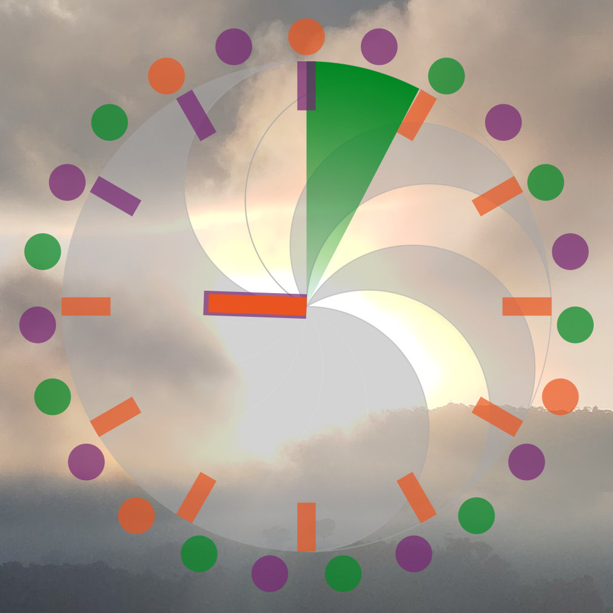

# Time Dial

This repository contains the Conky configuration to display a "Time Dial" widget on your desktop.

The Time Dial is an abstract way to represent date and time inspired by Analog Clocks and Ubuntu Touch's Stat Circle.



## Features

- Displays the current year as an abstract binary pattern:
- Highlights the hour marks to represent the current month
- Displays the current date as the number of dots around the dial
- Uses a clock hand to indicate the current hour
  - clock hand changes color based on AM/PM
- Displays the current minute as a pie chart that progresses as the minutes pass
- Colors for each element fully customizable:
- Lightweight and efficient, built using Lua and Cairo.

## Getting Started

### Prerequisites

Ensure you have Conky installed on your system. If not, install it using the following instructions based on your distro:

- **Ubuntu/Debian**: `sudo apt install conky-all`
- **Fedora**: `sudo dnf install conky`
- **Arch**: `sudo pacman -S conky-cairo`

Additionally, ensure Lua and Cairo libraries are available on your system.

### Installation

- Clone this repository:
  ```bash
  git clone https://github.com/feishikong/Time-Dial.git
  cd Time-Dial
  ./start.sh
  ```

### Customization

#### Calendar Appearance

The appearance can be customized by editing the `clock.lua` script. Search for the "settings" array.

---

## Contributing

Feel free to fork this repository and make your own modifications.

## License

This project is licensed under the MIT License. See the [LICENSE](LICENSE) file for details.

## Author

Work derived from Analog Clock & Calendar Cinky created by [Wim66](https://github.com/wim66).
